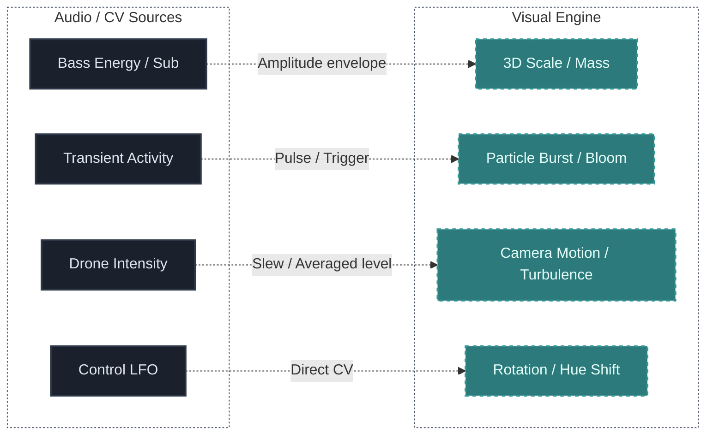

## What You Will Learn

By the end of this lesson, you should understand:

- how sound is converted into numbers to control graphics
- why amplitude is a good start, but a bad finish for audio-reactive visuals
- how to isolate frequency bands for selective reaction
- what data smoothing (smoothing/slew) is
- how to make mapping meaningful, rather than chaotically flickering

## Main Idea

An audiovisual system becomes impressive only when the visual layer responds to *actual musical structure*, and not just to the overall volume level.

Instead of forcing graphics to jump to a finished track (like classic equalizers), we can pull data right from the heart of the modular patch - before the voices get mixed together in the master.

## Why It Matters

Reactive visuals should not be random decoration. They should *reveal* hidden musical behavior to the viewer.

If there's chaos on the screen that loosely corresponds to what the audience hears, dissonance arises. The connection between visual and auditory must feel like a single "living organism".

## Useful Inputs for Mapping

To create high-quality audio-reactive visuals, you need to analyze the sound. Useful inputs for mapping:

- **Amplitude (Level/Volume):** overall signal volume. Good for scale or brightness.
- **Onset intensity (Transients):** detects sharp spikes in volume (drums, percussion). Great for particle generation or sharp strobes.
- **Frequency bands (FFT):** splits the sound. Lows can distort geometry, while highs can change color or noise density.
- **Rhythmic density (Energy over Time):** accumulated energetic activity over a short interval.

## Proper Mapping Examples

Mapping is the art of choosing *what affects what*. A good mapping has an internal logic:

## The Default Problem: "Jittery Graphics" and Smoothing

One of the most popular mistakes is routing a raw Envelope or audio signal directly to the scale of a visual layer. Sound happens incredibly fast. Graphics reacting at the speed of sound look jittery and cause visual fatigue.

Use smoothing nodes: **Smoothing**, **Lag**, or modular **Slew Limiting** before sending it to render. This makes the graphics react quickly (the attack remains instant), but return to their original shape more organically and smoothly.

## Typical Beginner Mistakes

### Mistake 1: Linear reaction to the master track
Reacting to the overall mix often turns into "mush", where it's impossible to isolate a specific instrument. It's much more effective to route individual stems (Kick only, Bass only) to the visualizer.

### Mistake 2: Visual Overload
If the entire screen is overflowing with effects jumping on every beat, it quickly gets tiring. Leave "negative space", let the graphics breathe.

### Mistake 3: Forgetting about Threshold
If you map sound without threshold values (Threshold/Noise-Gate), quiet background noise will cause micro-tremors in the object, making it "nervous". Set up a Gate so the effect triggers only when the element is truly playing.

## Practice

1. Take your favorite generative patch from the previous lessons.
2. Choose one musical feature in the patch: for example, an LFO controlling a filter.
3. Send this signal into a visual environment (e.g. use the built-in oscilloscope in VCV Rack, or route it to browser-based WebGL, Resolume, etc.).
4. Adjust the attenuator (Scale) - find the modulation depth of the graphics where the movement emphasizes the sound of the rhythm. Describe this mapping in writing.

## Bonus Exercise

Simulate the "Smoothing" (Slew/Lag) effect using internal modules: run a rhythmic short trigger through a Slew Limiter module before feeding it to control brightness or a video scrambler. Observe the difference between a hard trigger and a "fluid" smoothed signal.

## Next Connection

Once the principles of "parameter-to-parameter" mapping are clear, an engineering question arises: how do you transmit these values from a software modular without latency? We will break this down in the lesson on OSC and MIDI integration.

---

### Resources
- [View Patch Details: Generative Ambient v01](/patches/generative-generative-ambient-v01)
