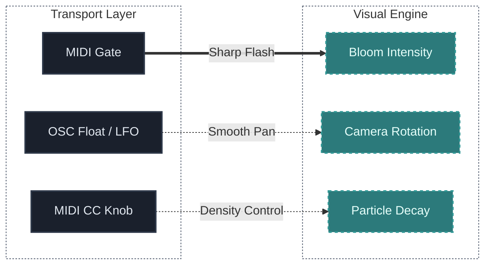

## What You Will Learn

By the end of this lesson, you should understand:

- the difference between MIDI and OSC protocols
- why MIDI is outdated for some tasks, but still indispensable
- what Open Sound Control (OSC) is and its advantages
- the principles of parameter mapping between different software ecosystems

## Main Idea

To connect sound and visuals when they exist in different software ecosystems (e.g., VCV Rack and TouchDesigner/WebGL), a reliable "transport layer" is needed.

Even the most brilliant patch won't rock 3D graphics if the commands don't arrive on time or are limited by low resolution.

Audiovisual projects use the following protocols:
- **MIDI** (Musical Instrument Digital Interface)
- **OSC** (Open Sound Control)
- **Internal mapping API** (if both subsystems live in the same program or browser)

## Why It Matters

Without a clear transport model and mapping documentation, an audiovisual setup becomes improvised and fragile. Setting up stable communication channels is the foundation without which you cannot start "forcing" pixels to move to the music.

## MIDI vs OSC

### MIDI (The Classic)
Transmits discrete events: "Note C3 pressed, Velocity 100" or CC (Continuous Control) messages.

**Pros:** Universal, supported by hardware and DAWs "out of the box". Excellent for triggers and quantized commands.
**Cons:** Low resolution (only 128 steps). When modulating a visual parameter slowly, this will cause stepping (jitter). Limited by channel count and physical cables.

### OSC (Open Sound Control - The Modern Standard)
Works via network protocols (UDP/TCP) and uses human-readable address paths. For example: `/synth/bass/filter` transmits the number `0.85231`.

**Pros:** Extremely high resolution (Float type), allowing the transmission of ultra-smooth generator curves and LFOs without jitter. Transmitted over a local network or Wi-Fi (you can send a signal from the musician's laptop to a powerful visualizer PC).
**Cons:** Requires network port configuration. Not all hardware understands OSC natively.

## Practical Use in the Project

- **MIDI** is ideal for *events* (Kick Drum trigger, Scene Change).
- **OSC** is ideal for transmitting *states of smooth and chaotic processes* (a slow LFO, the changing envelope curve of a drone).

## Typical Beginner Mistakes

### Mistake 1: Confusing network ports when using OSC
In OSC, IP addresses and Ports play a critical role. Beginners often forget that if VCV Rack sends data to `Port 8000`, the visual receiver must also be set to "Listen Port 8000".

### Mistake 2: Clogging the network with excess OSC messages
If you send audio frequencies (44,100 data points per second) over OSC, the network will instantly choke and freeze. For OSC, it's better to send only slowly changing parameter modulations.

## Routing in Rack (e.g., with the cvOSCcv module)
1. Output an LFO signal from a module in VCV.
2. Connect it into the input of an OSC module (found in the library).
3. Assign the local IP `127.0.0.1` (if everything is on one computer) and a port (like `7000`).
4. Configure the output path: `/vcv/lfo`.
5. In the target program, listen to port 7000 and the path `/vcv/lfo`.

## Practice

Create a mini-table ("Mapping List") with any three connections in your project:

**Example Mapping List:**

Think about which protocol would be best to transmit these 3 signals.

## Bonus Exercise

Try connecting your smartphone to your computer via OSC apps (e.g., "TouchOSC"). You'll be able to create your own interface with faders on your phone and send data directly to the audiovisual setup via Wi-Fi, controlling sound and visuals straight from your phone screen.

## Next Connection

Once channels are established and we know how to communicate with visual tools, it is time to put everything together—setting up the stage and preparing a complete Audiovisual Live "Scene", which we will analyze in the final lesson of this section.

---

### Resources
- [View Patch Details: Hybrid Live Set v01](/patches/performances-hybrid-live-set-v01)
