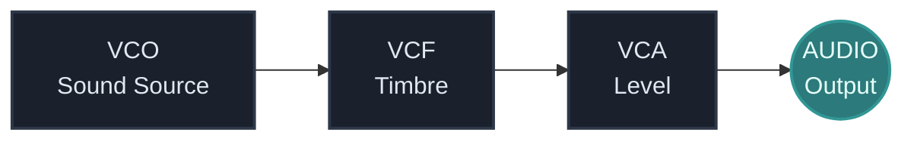
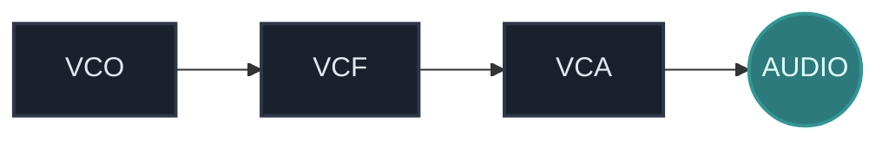

## What You Will Learn

By the end of this lesson, you should understand:

- why modular synthesis is different from a fixed synthesizer
- how to think in terms of roles instead of products
- what a minimal audio path looks like
- why signal flow matters more than brand or module count
- how this way of thinking supports every later track in `Modular Genesis`

## Core Idea

Modular synthesis is a way of building an instrument from separate functional blocks.

Instead of opening one fixed synthesizer with a prewired internal structure, you connect the parts yourself and decide what each stage of the system does.

That means the instrument is not defined in advance. The instrument appears only when the patch is built.

In practice, most beginner patches are made from a small number of clear roles:

- sound source
- timbre shaping
- amplitude control
- modulation
- timing

In `VCV Rack`, this means the instrument is not a single plugin with a hidden architecture. The patch itself is the instrument.

## Why This Matters

`Modular Genesis` is not centered on presets. It is centered on systems.

That matters because every later topic in the project depends on understanding how larger behavior is built from smaller units:

- sequencing is built from timing and control signals
- generative systems are built from clocks, probability, and modulation
- hybrid workflows depend on knowing what role each layer plays
- audiovisual mapping becomes much easier when sound is already understood as a modular system

If you skip this systems view, later lessons can feel like a pile of disconnected techniques. If you understand it early, the whole roadmap becomes more coherent.

## Fixed Synth Vs Modular Thinking

A fixed synthesizer usually gives you a mostly complete signal path from the start. Even if the interface exposes many controls, the internal structure is already decided for you.

Modular synthesis changes the question.

Instead of asking:

- "Which preset should I choose?"
- "Which synth does this sound come from?"

you start asking:

- "Where does the sound begin?"
- "What is shaping the tone?"
- "What is controlling loudness?"
- "What is changing over time?"
- "What should happen first in the signal path?"

This is the real mindset shift. Modular work is not only about cables. It is about understanding function and order.

## Minimal Signal Flow

A very small beginner patch can be described like this:

This is not the only correct structure, but it is a useful first model.

### VCO

The oscillator creates raw audio material.

It answers the question:

- what is producing the sound in the first place?

Without a source, there is nothing to shape.

### VCF

The filter shapes the timbre by removing or emphasizing parts of the frequency spectrum.

It answers the question:

- what should the tone feel like?

Bright, dull, narrow, hollow, or aggressive colors often begin here.

### VCA

The amplifier controls level.

It answers the question:

- when and how loudly should this sound be heard?

Even if beginners think of it as "just volume," it becomes one of the most important control points in modular synthesis.

### AUDIO

The output stage sends the finished signal to your speakers, headphones, recording chain, or DAW.

It answers the question:

- where does the signal leave the patch?

## Audio Signals Vs Control Signals

One of the most important ideas in modular synthesis is that not every cable is doing the same job.

Some signals are:

- audio-rate signals that you actually hear

Others are:

- control signals that shape, trigger, or modulate what you hear

At this stage, you do not need full technical precision yet. You only need to recognize that a modular patch usually contains both:

- sound generation
- behavior control

That distinction becomes central in the next lessons.

## How To Read A Patch

A useful beginner habit is to read a patch from left to right in terms of function:

1. Where is the sound created?
2. Where is the sound shaped?
3. Where is level controlled?
4. What is moving or changing over time?
5. Where does the final signal leave the system?

This habit matters more than memorizing specific module brands.

## Common Beginner Mistakes

### Mistake 1: Thinking modules are the same as instruments

A module is usually a role or function, not a whole finished instrument.

### Mistake 2: Collecting modules before understanding flow

Beginners often try to use too many modules too early.

A clean four-block patch teaches more than a messy twenty-module patch you cannot explain.

### Mistake 3: Ignoring the VCA

Many people focus on oscillators and filters first, but the VCA is what makes control meaningful. Later, envelopes and modulation often become most useful when they act through a VCA.

### Mistake 4: Treating cables as decoration

Each cable should answer a functional question. If you cannot explain what a connection does, the system is still unclear.

## Practice

Open `VCV Rack` and identify these module roles:

1. a sound source
2. a filter
3. a level control stage
4. an output

Then write down, in one short sentence each:

- what signal enters the module
- what the module changes
- what signal leaves the module

If you can explain those four modules clearly, you already understand the first layer of modular thinking.

## Extra Exercise

Build the simplest possible patch using the model below:

Then ask yourself:

- what changes when I bypass the filter?
- what changes when I lower the VCA level?
- what is the difference between "the sound exists" and "the sound is heard"?

These questions sound basic, but they are the foundation for every more advanced patch later.

## Next Connection

The next lesson should make one distinction much clearer:

- `CV` vs `audio`

This is the point where modular patches stop looking like a chain of boxes and start reading like an actual signal system.

---

### Resources
- [View Patch Details: Basic Voice v01](/patches/foundations-basic-voice-v01)
