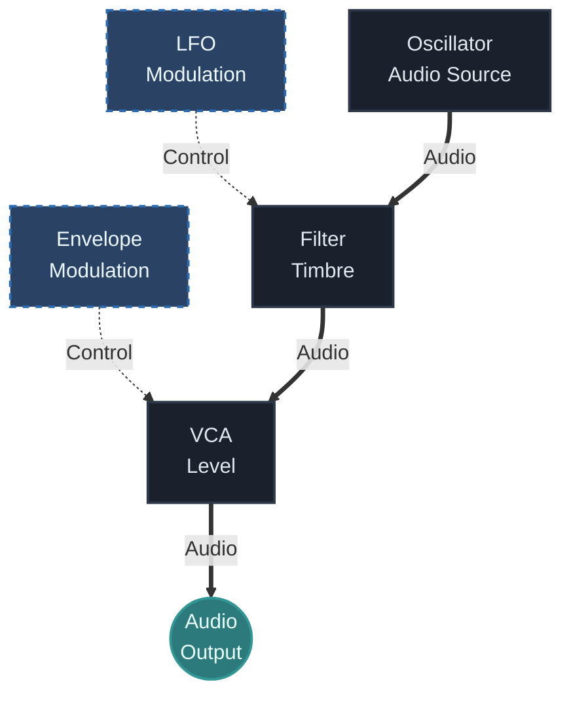

## What You Will Learn

By the end of this lesson, you should understand:

- what `audio` means in a modular patch
- what `CV` means and why it matters
- why two cables can look similar but serve completely different roles
- how to quickly identify whether a signal is meant to be heard or to control something
- how this distinction helps you build cleaner and more intentional patches

## Core Idea

In modular synthesis, not every signal is sound.

Some signals are meant to be heard. Those are audio signals.

Other signals are meant to change behavior inside the system. Those are control signals, often described as `CV` or control voltage.

This distinction is one of the most important ideas in modular practice because it changes how you think about patching. A cable is not only a connection. It is a statement about function.

## Why This Matters

If you do not understand the difference between `CV` and `audio`, modular patches can feel confusing very quickly.

You may know that something is "connected," but not know what that connection is supposed to do.

Once the distinction becomes clear, patches become easier to read:

- audio paths explain what you hear
- control paths explain why the sound changes

That is the foundation for envelopes, sequencing, automation, modulation, generative systems, and performance control.

## Audio Signals

An audio signal is a signal intended to be heard directly.

Typical examples include:

- oscillator output
- noise source output
- filter output after tone shaping
- final signal leaving a mixer or VCA

When audio reaches your speakers, headphones, recorder, or DAW input, it becomes the sound result of the patch.

In simple terms, audio answers this question:

- what is the system sounding like right now?

## Control Signals

A control signal is not primarily there to be listened to. It exists to change the behavior of another part of the system.

Typical examples include:

- pitch control for an oscillator
- an envelope controlling VCA level
- an `LFO` moving filter cutoff
- a sequencer changing note values over time
- gates and triggers causing events to happen

In simple terms, `CV` answers this question:

- what is making the system move, respond, or transform?

## Same Cable, Different Job

One reason this topic confuses beginners is that the patch cable itself does not tell you whether the signal is audio or control.

The same physical cable can carry:

- a heard waveform
- a slow modulation shape
- a pitch instruction
- a gate event

So the correct question is never just:

- "Is there a cable?"

The better question is:

- "What role is this signal playing in this connection?"

## Practical Rule

Whenever you patch something, ask:

1. Is this signal meant to be heard?
2. Or is it meant to control another parameter?

This simple rule solves a large part of beginner confusion.

If the answer is "I should hear it," you are probably dealing with audio.

If the answer is "it should change something else," you are probably dealing with control.

## A Simple Example

Consider this patch:

Here the roles are different:

- the oscillator is audio
- the filter path is still audio
- the `LFO` is control
- the envelope is control
- the VCA output becomes final audio again

This is the point where modular systems begin to make sense. You are not only connecting modules. You are connecting different kinds of behavior.

## How To Recognize The Difference Fast

When reading a patch, use this quick check:

### If the signal goes to an audio path

Examples:

- mixer input
- filter audio input
- VCA audio input
- final output

it is probably audio.

### If the signal goes to a parameter input

Examples:

- cutoff modulation
- pitch input
- VCA level control
- wavefolder amount

it is probably control.

This is not a perfect technical rule in every module ecosystem, but it is extremely useful for beginners.

## Common Beginner Mistakes

### Mistake 1: Treating every connection as if it were sound

Not everything in the patch is part of the audible chain. A lot of modular intelligence lives in control relationships.

### Mistake 2: Thinking `CV` is only pitch

Pitch is only one form of control. `CV` can affect amplitude, timbre, timing, probability, panning, effects, and more.

### Mistake 3: Ignoring modulation destinations

Beginners often focus on the source of control but forget to ask what the destination input is actually changing.

### Mistake 4: Using modulation without listening for purpose

Just because an `LFO` can move a parameter does not mean it should. The useful question is whether the motion supports the musical result.

## Practice

Build a simple patch and test these three signal types:

1. Oscillator to output
2. `LFO` to filter cutoff
3. Envelope to `VCA` level

Then describe each one in one sentence:

- is it heard directly or not?
- what does it change?
- how does the patch behave differently when it is removed?

## Extra Exercise

Take one modulation source such as an `LFO` and route it to three different destinations one at a time:

- oscillator pitch
- filter cutoff
- VCA level

Do not patch all three at once at first.

Listen and write down:

- which result feels musical
- which result feels unstable
- which destination is easiest to understand

This exercise trains your ear to connect signal type with behavioral outcome.

## Next Connection

The next lesson should make this distinction practical by building a complete first subtractive patch.

That is where `audio` and `CV` stop being abstract categories and start working together as a playable instrument.

---

### Resources
- [View Patch Details: Basic Voice v01](/patches/foundations-basic-voice-v01)
