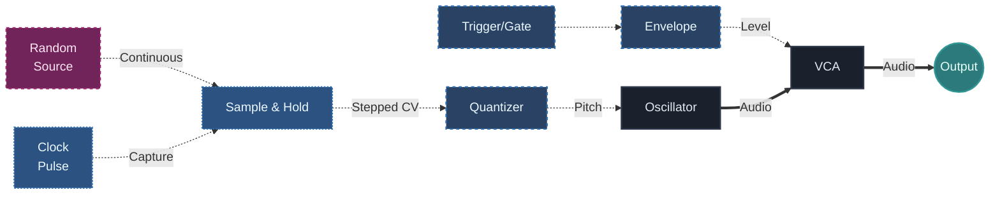

## What You Will Learn

By the end of this lesson, you should understand:

- why free randomness often feels unusable until it is structured
- what `Sample & Hold` actually does in a patch
- how clocked sampling turns continuous change into stepped behavior
- why quantization is often the next useful stage after `Sample & Hold`
- how to patch a simple generative pitch system that still feels controlled

## Core Idea

Randomness becomes musically useful when it is sampled at meaningful times.

A continuously changing random signal can be interesting, but without timing control it often feels unstable, slippery, or hard to phrase.

`Sample & Hold` changes that.

It works like this:

- a random source is available continuously
- a clock decides when to capture a value
- the held value remains stable until the next capture

That simple process is one of the most important generative building blocks in modular synthesis.

## Why This Matters

Generative patching does not mean "let chaos take over."

In practice, the strongest generative systems are usually built from a balance between:

- unpredictability
- timing control
- range control
- musical constraints

`Sample & Hold` is one of the clearest examples of that balance.

It takes something unstable and makes it legible.

## Free Random Vs Clocked Random

It helps to separate two situations.

### Free Random

A random source may move constantly and continuously.

That can be useful for:

- texture
- drift
- analog instability
- organic motion

But it is often less useful for clear melodic sequencing on its own.

### Clocked Random

Once a clock tells the system when to capture the value, randomness becomes event-based.

Now the patch has:

- a moment when change happens
- a stable value between events
- clearer phrasing

This is the first big shift from abstract randomness to usable generative behavior.

## What Sample & Hold Does

`Sample & Hold` captures an incoming voltage when it receives a trigger or clock event, then holds that value until the next event.

That means it answers two questions at once:

- what value was present at the sampling moment?
- how long should that value remain stable?

This is why it is such a powerful module. It creates discrete steps from a continuously changing source.

## Basic Patch

The core patch looks like this:

In this patch:

- the random source provides unpredictable voltage
- the clock decides when a new note value appears
- `Sample & Hold` freezes that value
- the quantizer makes the result musically readable

This is one of the simplest and strongest beginner generative pitch systems.

## Why The Quantizer Helps Here

Without a quantizer, `Sample & Hold` can still create stepped variation, but pitch may feel too arbitrary.

With a quantizer:

- the random changes stay inside a scale
- the melodic result becomes easier to hear as intention rather than noise
- experimentation becomes easier to evaluate

This is a recurring modular lesson:

randomness becomes stronger when its output space is constrained.

## What To Listen For

When the patch is working, listen for these separate layers:

### Rate Of Change

How often does a new value appear?

### Stability Between Changes

Does the pitch remain clearly held between clock events?

### Musical Range

Does the quantized output stay within a usable note space?

### Phrase Character

Does the result feel sparse, busy, calm, nervous, tonal, or strange?

This kind of listening is important because generative systems are easier to shape when you can hear the different control layers separately.

## Slow Clock Vs Fast Clock

A useful beginner lesson is to compare clock speeds.

### Slow Clock

- fewer note changes
- more space between events
- often more ambient or sparse feeling

### Fast Clock

- more active patterns
- more obvious motion
- greater risk of sounding busy or chaotic

The important point is that the random source may stay the same while the musical meaning changes completely because the sampling rhythm changes.

## Common Beginner Mistakes

### Mistake 1: Using randomness without timing structure

If the patch keeps changing but never settles, it can feel more confusing than musical.

### Mistake 2: Blaming the random source for bad phrasing

Often the issue is not "too much randomness." The issue is missing clock logic, range control, or quantization.

### Mistake 3: Letting the pitch range become too wide

If the sampled voltage covers too much range, the result can jump too far to feel coherent.

### Mistake 4: Forgetting that `Sample & Hold` is a timing tool as much as a variation tool

It does not only create random notes. It defines when a value is allowed to change.

## Practice

Try these three tests:

1. Slow clock for sparse note changes
2. Fast clock for active patterns
3. Different scales in the quantizer

For each version, write down:

- what is changing randomly
- what is being held stable
- what the clock is controlling
- whether the result feels musical, unstable, calm, or chaotic

## Extra Exercise

Take the same patch and vary only one parameter at a time:

- clock speed
- pitch range before the quantizer
- scale choice in the quantizer

Do not change everything at once.

This teaches one of the most useful generative habits:

separate the source of unpredictability from the rules that shape it.

## Next Connection

Now that you can turn randomness into stepped melodic behavior, the next step is to shape how often things happen and how likely certain events are.

That leads naturally into probability and mutation.

---

### Resources
- [View Patch Details: Generative Ambient v01](/patches/generative-generative-ambient-v01)
