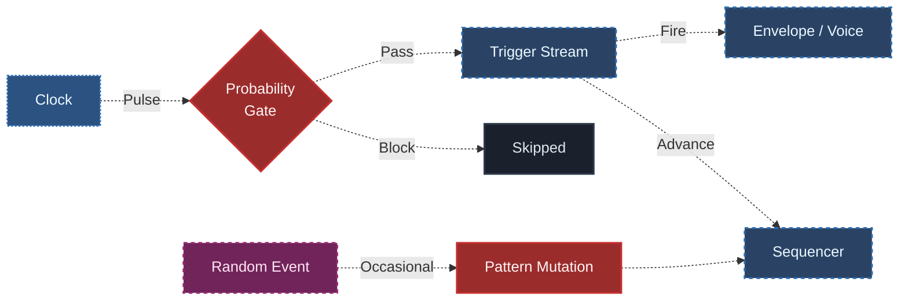

## What You Will Learn

By the end of this lesson, you should understand:

- what probability means in a modular patch
- how mutation differs from pure randomness
- why skipping events can be more musical than replacing everything
- how to keep a generative patch moving without letting it collapse into noise
- how to test stability versus variation in a controlled way

## Core Idea

Probability is one of the main tools that makes a modular patch feel alive.

It controls whether something should happen, not only what should happen.

That difference matters a lot.

Instead of rewriting the whole system, probability can soften repetition by making events conditional.

That means it can affect:

- note density
- rhythmic variation
- trigger skipping
- accent patterns
- pattern mutation

This is where a patch starts to feel less mechanical without becoming directionless.

## Why This Matters

A repeating patch becomes generative when repetition is softened by conditional change.

If everything repeats exactly, the system may feel static.

If everything changes all the time, the system may lose identity.

Probability gives the patch space to evolve while keeping a recognizable center.

Mutation does something related but slightly different:

- probability controls whether an event happens
- mutation changes how the pattern behaves over time

Together they create living structure instead of rigid looping or uncontrolled chaos.

## Probability: Conditional Events

In modular synthesis, probability often means that an event has some chance of happening rather than being guaranteed every time.

For example:

- a trigger may fire only 70% of the time
- a note may skip occasionally
- a reset may happen rarely
- an accent may appear conditionally

This is powerful because it changes behavior without necessarily changing the whole architecture.

Probability answers:

- should this event happen now?

## Mutation: Pattern Change Over Time

Mutation is not just randomness.

A useful way to think about mutation is:

- a pattern exists
- some part of that pattern changes
- the system still preserves enough identity to be recognizable

Mutation can affect:

- one step in a sequence
- one pitch choice
- one rhythmic event
- one modulation destination
- one rule in the patch logic

Mutation answers:

- how can the system become different without becoming unrelated?

## Probability Vs Mutation

These concepts are connected, but they are not the same.

### Probability

- decides whether an event occurs
- often works moment to moment
- affects density and variation

### Mutation

- changes the pattern itself
- often works across longer spans of time
- affects identity and development

A strong generative patch often uses both:

- probability for short-term behavior
- mutation for longer-term evolution

## Basic Patch Idea

A practical beginner patch might look like this:

Here the roles are clear:

- the clock provides structure
- the probability stage decides whether events pass through
- the downstream system responds only when events survive
- a separate change source can occasionally mutate the pattern

This preserves the core pulse while allowing the system to breathe.

## Why Skipping Is So Powerful

One of the most useful beginner lessons is that removing events can be as musically important as adding new ones.

If every trigger always happens, the patch may feel too fixed.

If some triggers are skipped:

- density changes
- groove shifts
- phrases open up
- repetition becomes less obvious

Probability often works best not by making everything strange, but by introducing selective absence.

## Stable Identity Vs Loose Variation

This is the central balancing act in generative design.

### Too Stable

- the patch repeats exactly
- the listener learns the pattern too quickly
- the system may feel static

### Too Loose

- too many events disappear
- pitch or rhythm loses coherence
- the system stops sounding intentional

The goal is usually not maximum randomness. The goal is controlled motion inside a recognizable frame.

## What To Listen For

When working with probability and mutation, listen for:

### Event Density

How busy or sparse does the system feel?

### Identity

Does the patch still feel like "the same pattern" after change happens?

### Surprise

Are the variations interesting or merely confusing?

### Long-Term Behavior

Does the patch feel like it develops, or does it just wobble aimlessly?

This kind of listening matters because generative systems are judged less by isolated events and more by how they behave over time.

## Common Beginner Mistakes

### Mistake 1: Equating probability with quality

More variation is not automatically better. Too much conditional behavior can erase the structure that made the patch interesting.

### Mistake 2: Mutating everything at once

If too many layers change together, it becomes difficult to hear what is actually shaping the result.

### Mistake 3: Using probability without a clear base pattern

Variation is most meaningful when there is something stable to vary.

### Mistake 4: Forgetting time scale

Some changes should happen every beat. Others should happen every few bars. Mutation becomes much more musical when it operates on a slower time scale than the main pulse.

## Practice

Make one patch with highly stable behavior and one patch with higher variation.

Compare:

1. How often events are skipped
2. How much identity the pattern keeps
3. When variation becomes too loose

For each version, write down:

- what remains fixed
- what changes conditionally
- whether the patch feels alive, repetitive, or chaotic

## Extra Exercise

Take one stable pattern and introduce only one kind of variation at a time:

- trigger probability
- occasional note mutation
- probability on accents only

Do not stack everything immediately.

This teaches a crucial generative design principle:

small conditional changes are often stronger than large uncontrolled ones.

## Next Connection

Once probability and mutation are working, the next step is to explore feedback and slower modulation systems that reshape the patch over longer spans of time.

That is where generative design begins to feel truly environmental and evolving.

---

### Resources
- [View Patch Details: Probability Grid v01](/patches/generative-probability-grid-v01)
