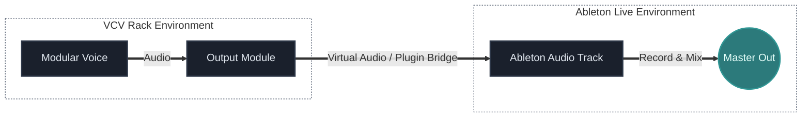

## What You Will Learn

By the end of this lesson, you should understand:

- how the project treats `VCV Rack` and `Ableton Live` as different layers of one system
- the difference between standalone Rack and hosted Rack workflows
- what it means for one application to own the audio engine
- how audio typically moves from Rack into Ableton
- how to plan routing before patching so the system stays clear

## Core Idea

The hybrid model of this project treats the tools differently:

- `VCV Rack` generates and transforms sound
- `Ableton Live` records, arranges, edits, and mixes

That separation is useful because each tool is strongest at a different job.

But to make the workflow reliable, audio has to move cleanly between them.

A lot of hybrid frustration comes from unclear routing, not from bad sound design.

## Why This Matters

If you do not know which application owns the audio path, hybrid work becomes confusing very quickly.

Common problems usually come from questions like:

- where is the audio engine actually running?
- which app is monitoring the signal?
- which app is recording the result?
- is Rack behaving like an instrument, a processor, or a standalone system?

Once those roles are clear, the workflow becomes much simpler.

## The Main Hybrid Principle

Before patching anything, decide three things:

1. What generates the sound?
2. What receives the sound?
3. What records or arranges the sound?

This sounds basic, but it prevents a lot of unnecessary troubleshooting.

## Main Scenarios

There are two common hybrid setups.

### Standalone Rack

In this model:

- Rack owns the audio engine
- Rack runs as a separate application
- Ableton receives audio from outside Rack
- virtual routing may be required

This setup is useful when:

- Rack is functioning as a self-contained modular environment
- you want Rack to run independently
- you are comfortable managing inter-application audio routing

### Hosted Rack

In this model:

- Ableton owns the audio engine
- Rack behaves like a plugin inside the DAW
- routing is usually simpler
- recording and synchronization are often more direct

This setup is useful when:

- Ableton is the center of the session
- you want easier recall and arrangement
- you prefer the DAW to control transport and project flow

## What "Owning The Audio Engine" Means

This is one of the most important practical ideas.

If an application owns the audio engine, it is the one that:

- talks directly to the audio device
- manages buffer settings
- defines the active monitoring path

So when Rack owns the audio engine, Ableton has to receive audio from Rack somehow.

When Ableton owns the audio engine, Rack usually behaves as a sound source or processor inside Ableton's environment.

That single distinction explains a lot of routing confusion.

## A Simple Routing Model

A basic standalone routing idea looks like this:

The important thing is not the exact software utility first.

The important thing is understanding:

- where the sound leaves Rack
- how it enters Ableton
- where it is monitored and recorded

## Why Virtual Routing Exists

When Rack runs separately from Ableton, the audio has to travel from one application to another.

That usually requires:

- a plugin-hosted path
- a virtual audio cable or loopback route
- or another system-level audio bridge

The exact utility depends on platform and workflow, but the concept stays the same:

audio must leave one software environment and arrive in another without ambiguity.

## Common Beginner Mistakes

### Mistake 1: Patching first and deciding the routing later

This often leads to sound existing in Rack but not arriving where you expect in Ableton.

### Mistake 2: Forgetting who is monitoring

Sometimes audio is present, but you are listening through the wrong application path.

### Mistake 3: Confusing sound generation with recording

Rack may be the sound engine, but Ableton may still be the place where the final performance is captured and arranged.

### Mistake 4: Making the system more complex than necessary

If your goal is simply "Rack voice into Ableton track," start with the smallest clean route and only then add returns, effects, clocking, or multichannel complexity.

## Practice

Draw your exact routing plan before patching:

1. What generates the sound
2. What receives the sound
3. What records it

Then write one more line for each:

- where monitoring happens
- which application owns the audio engine
- where the signal leaves one environment and enters the other

This small planning step is one of the best hybrid habits you can build.

## Extra Exercise

Take one simple modular voice and describe it in both workflow models:

- standalone Rack sending audio into Ableton
- Rack hosted inside Ableton

For each version, ask:

- what becomes easier?
- what becomes harder?
- which model fits your real workflow better?

## Next Connection

Once routing is clear, the next hybrid step is capturing and organizing more than one signal path at a time.

That leads naturally into multichannel recording and more structured studio integration.

---

### Resources
- [View Patch Details: Hybrid Live Set v01](/patches/performances-hybrid-live-set-v01)
