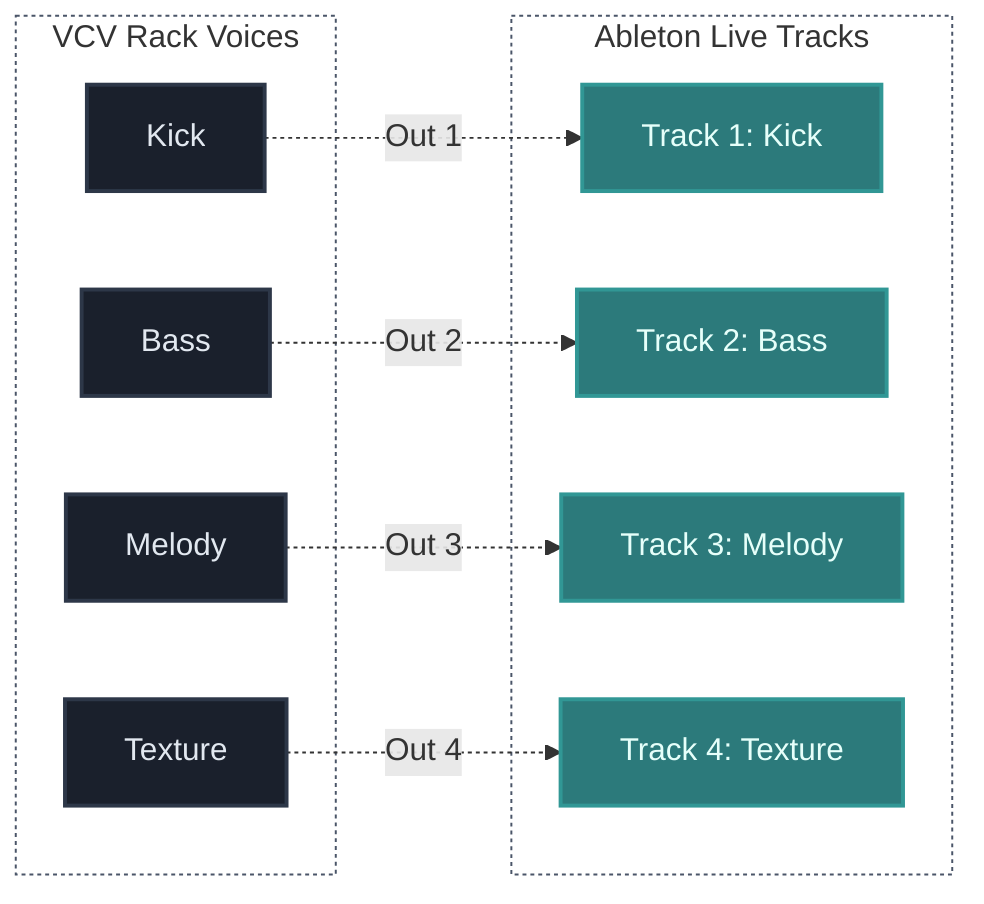

## What You Will Learn

By the end of this lesson, you should understand:

- why recording one stereo master is often too limiting for hybrid work
- how separate outputs create control at the mix stage
- which voices are usually worth isolating on their own channels
- how to plan a routing map before recording
- how multichannel recording changes the way you build a patch

## Core Idea

When a modular patch becomes more musical, it usually also becomes more layered.

You may have:

- a kick or low percussion voice
- a bass voice
- a melodic line
- a texture layer
- a drone or atmospheric bed

If all of that is printed as one stereo file, you lose a lot of control later.

Multichannel recording solves that by separating important voices before they reach the DAW.

## Why This Matters

The DAW becomes much more useful when each important role arrives on its own track.

Instead of treating the modular system like a finished stereo performance, you can treat it like a group of playable stems.

That gives you stronger control over:

- `EQ`
- compression
- automation
- arrangement
- spatial placement
- muting and editing

This is one of the biggest advantages of a hybrid workflow.

## The Main Principle

Do not ask only:

"How do I record the patch?"

Also ask:

"Which parts of the patch deserve independence later?"

That question changes everything.

A good hybrid recording setup is not just about capture.

It is about preserving decisions you may want to refine later.

## Stereo Print Vs Multichannel Capture

### One Stereo Print

This approach is simple:

- fast to set up
- easy to monitor
- good for rough captures or performance studies

But it is limited because:

- one loud voice can dominate the whole mix
- effects become permanently glued to the recording
- you cannot rebalance voices cleanly afterward

### Multichannel Capture

This approach takes more planning:

- you route key voices to separate outputs
- the DAW records them on separate tracks
- each role stays editable later

It is stronger when:

- the patch has multiple independent voices
- you want real mix control
- you may edit arrangement after recording
- you want better recall of musical roles

## What Usually Deserves Its Own Channel

Not every signal needs isolation.

Start with the voices that carry the strongest structural role.

Common examples:

- kick or main percussion
- bass
- lead or melody
- texture or noise layer
- drone or ambience

You can also separate:

- dry and wet signals
- rhythmic and non-rhythmic layers
- clean tone and heavily processed tone

The point is not maximum channel count.

The point is useful control.

## A Simple Routing Model

Each output then becomes its own audio track in Ableton.

## How Multichannel Recording Changes Patch Thinking

Once you know that voices will be recorded separately, you often patch more intentionally.

You start asking:

- which layer is the foundation?
- which layer needs its own processing later?
- which effects should stay inside the modular patch?
- which effects should be added in the DAW instead?

This leads to cleaner systems.

For example, you may decide:

- keep timing and synthesis inside the modular patch
- record voices mostly dry
- shape space and final balance later in Ableton

That is often easier to manage than printing one already-finished stereo world.

## Common Beginner Mistakes

### Mistake 1: Separating everything without a reason

More outputs are not automatically better.

If the channels do not serve clear musical roles, the session becomes harder to manage.

### Mistake 2: Recording layered sounds that should have stayed together

Some sounds are designed as one combined object.

If you split them unnecessarily, you may lose the character that made the patch work.

### Mistake 3: Forgetting level balance before recording

Separate tracks help later, but wildly inconsistent levels still create unnecessary cleanup work.

### Mistake 4: Not naming tracks by function

In hybrid work, naming matters.

`Bass`, `Lead`, `Noise`, and `Drone` are much better than vague labels like `Audio 1` or `Input 4`.

## Practice

Design a four-voice routing map for one hybrid session.

For each voice, define:

1. its musical role
2. why it deserves its own output
3. whether it should be recorded dry or with effects
4. what kind of processing you expect to do later in Ableton

Then ask one more question:

If you had to reduce the session from four outputs to two, which voices would you group together and why?

That forces you to think in terms of structure, not just channel count.

## Extra Exercise

Take a patch you already understand and create two recording strategies for it:

- a fast stereo capture version
- a multichannel version

Compare them by asking:

- which one is faster to finish?
- which one gives better mix control?
- which one better fits the musical goal?

## Next Connection

Once routing and channel planning are clear, the next step is making the DAW and the modular system feel rhythmically connected.

That leads directly into clock sync and transport relationships between hardware, VCV Rack, and Ableton.

---

### Resources
- [View Patch Details: Modular Jam Router v01](/patches/performances-modular-jam-router-v01)
