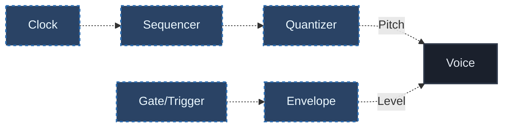
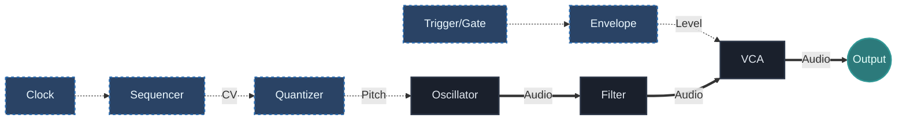

## What You Will Learn

By the end of this lesson, you should understand:

- what a sequencer contributes to a modular patch
- what a quantizer does and why it matters for pitch control
- how raw voltage becomes musical note information
- why sequencing and quantization are often strongest when used together
- how to build and test a simple melodic chain

## Core Idea

A sequencer gives the patch ordered voltage changes over time.

A quantizer takes those voltages and maps them onto discrete musical pitch values.

Together they turn timing structure into note behavior.

The core signal path often looks like this:

This is one of the most important modular music structures because it connects:

- time
- pitch
- articulation

into one readable system.

## Why This Matters

The previous lesson explained how timing signals organize events.

This lesson adds pitch organization.

Without that step, a patch may move rhythmically but still feel musically vague. Once a sequencer and quantizer are working together, the system starts producing repeatable melodic behavior.

That is the bridge between raw modular control and actual musical phrasing.

## Sequencer: Ordered Voltage Over Time

A sequencer outputs a changing series of values step by step.

Those values are usually driven by a clock.

Typical roles of a sequencer include:

- moving through an 8-step or 16-step pattern
- outputting pitch control values
- defining repeated structure
- creating the basis for variation later

A sequencer answers:

- what value should happen at this step in time?

## Quantizer: Turning Voltage Into Notes

A quantizer takes incoming voltage and constrains it to specific pitch values, often inside a chosen scale.

This matters because raw control voltage does not automatically land on musically useful notes.

A quantizer helps by making pitch choices legible:

- major scale
- minor scale
- pentatonic scale
- custom note sets

A quantizer answers:

- how should this voltage be interpreted musically?

## Why Quantization Is So Useful

Without a quantizer:

- melodies may drift into arbitrary pitch
- random voltage becomes harder to control
- small changes can sound less intentional

With a quantizer:

- scale choices become clear
- mutation stays musical
- experimentation becomes easier to manage

This is why quantizers are so important in modular systems. They do not remove creativity. They make voltage easier to steer.

## Sequencer Vs Quantizer

These two modules do related but very different jobs.

### Sequencer

- decides the order of values over time
- creates the pattern
- controls motion from step to step

### Quantizer

- interprets those values as scale-aware notes
- constrains pitch space
- keeps melodic behavior coherent

A useful way to say it:

- the sequencer chooses movement
- the quantizer chooses how that movement fits musical pitch logic

## Basic Patch Example

A simple beginner chain looks like this:

In this patch:

- the clock advances time
- the sequencer outputs changing values
- the quantizer turns those values into usable notes
- the envelope and `VCA` shape articulation

This is where pitch sequencing begins to feel structured instead of accidental.

## What To Listen For

When this patch is working, listen for three different layers:

### Repetition

Does the pattern return predictably?

### Pitch Identity

Does the melody feel like it belongs to a scale or tonal space?

### Articulation

Do the notes feel struck, held, sharp, soft, or mechanical?

These are separate dimensions. A good beginner habit is to hear them separately instead of treating the patch as one undivided result.

## One Step Can Change Everything

One of the most useful lessons in sequencing is that changing a single step can significantly alter the phrase.

That is important because it teaches modular phrasing at a small scale.

You do not always need a new pattern. Sometimes changing:

- one step value
- one note in the scale
- one gate length

is enough to create a meaningful variation.

## Common Beginner Mistakes

### Mistake 1: Expecting the sequencer alone to sound musical

A sequencer can output useful control values, but without quantization the pitch result may feel unstable or arbitrary.

### Mistake 2: Confusing rhythm problems with pitch problems

Sometimes the sequence sounds wrong because the articulation is off, not because the notes are wrong.

### Mistake 3: Changing too many steps at once

If you edit the whole pattern immediately, it becomes harder to hear what each change is doing.

### Mistake 4: Treating the quantizer as a correction tool only

A quantizer is not only for "fixing" notes. It is also a composition tool that defines the musical space of the patch.

## Practice

Build a simple pitch chain and test:

1. One repeating 8-step melody
2. One melody in a minor scale
3. One version with a single step changed

For each version, write down:

- what the sequencer is doing
- what the quantizer is constraining
- whether the change affected repetition, melody, or mood

## Extra Exercise

Take the same sequence and try these variations one at a time:

- same sequence, different scale
- same scale, one changed step
- same pitch pattern, different gate behavior

This exercise teaches an important point:

melody in modular systems is not only about note values. It also emerges from how pitch, timing, and articulation interact.

## Next Connection

You now have the core of a basic sequencing voice:

- clock
- trigger/gate
- sequencer
- quantizer
- playable voice

From here, the next step is to move from stable sequencing into variation, mutation, and more generative behavior.

---

### Resources
- [View Patch Details: Clock Quantizer Demo v01](/patches/sequencing-clock-quantizer-demo-v01)
