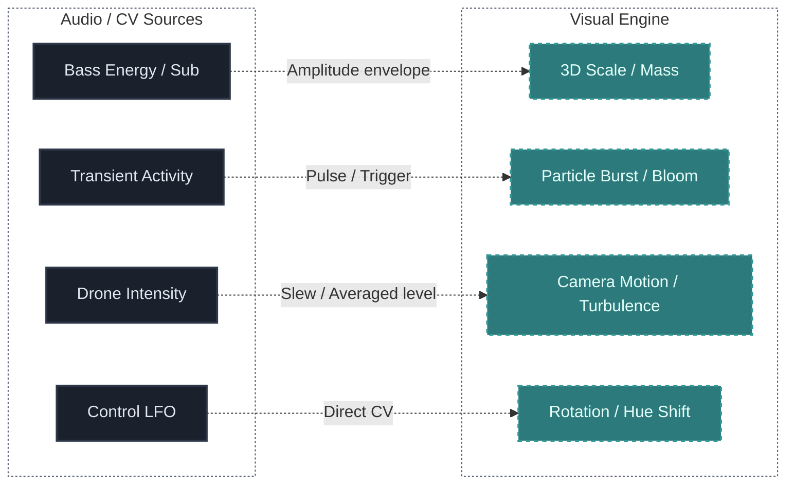

## Что ты изучишь

К концу урока ты должен понять:

- как звук переводится в цифры для управления графикой
- почему амплитуда — хороший старт, но плохой финал для аудио-реактива
- как изолировать частотные полосы для выборочной реакции
- что такое сглаживание данных (smoothing/slew)
- как сделать маппинг осмысленным, а не хаотично мелькающим

## Основная идея

Аудиовизуальная система становится впечатляющей только тогда, когда визуальный слой реагирует на *реальную музыкальную структуру*, а не просто на общий уровень громкости.

Вместо того чтобы заставлять графику прыгать под готовый трек (как классические эквалайзеры), мы можем забирать данные прямо из сердца модульного патча — до того, как голоса смешаются вместе в мастере.

## Почему это важно

Реактивная визуализация не должна быть случайным украшением. Она должна *раскрывать* скрытое музыкальное поведение для зрителя.

Если на экране творится хаос, который слабо соотносится с тем, что слышит аудитория, возникает диссонанс. Связь между визуальным и аудиальным должна чувствоваться как единый "живой организм". 

## Полезные входные данные для маппинга

Для создания качественного аудио-реактива нужно анализировать звук. Полезные входы для маппинга:

- **Амплитуда (Level/Volume):** общая громкость сигнала. Хороша для масштаба или яркости.
- **Интенсивность атак (Transients):** выявляет резкие всплески громкости (барабаны, перкуссия). Отлично для генерации частиц (particles) или резких вспышек (strobes).
- **Частотные полосы (FFT):** разделяет звук. Низкие могут искажать геометрию, а высокие — менять цвет или плотность шума.
- **Ритмическая плотность (Energy over Time):** накопленная энергетическая активность за короткий интервал.

## Примеры правильного маппинга

Маппинг — это искусство выбора, *что на что* влияет. Хороший маппинг имеет внутреннюю логику:

## Проблема "Дерганой Графики" и Сглаживание

Одна из самых популярных ошибок — направлять сырой Envelope или аудиосигнал прямо на масштаб визуального слоя. Звук происходит невероятно быстро. Графика, реагирующая со скоростью звука, выглядит судорожно и вызывает усталость.

Используйте узлы сглаживания: **Smoothing**, **Lag** или модульный **Slew Limiting** перед отправкой на рендер. Это заставляет графику реагировать быстро (атака остается мгновенной), но возвращаться к изначальной форме более органично и плавно.

## Типичные ошибки новичков

### Ошибка 1: Линейная реакция на мастер-трек
Реакция на общий микс часто превращается в "кашу", где невозможно вычленить конкретный инструмент. Эффективнее направлять на визуализатор отдельные стеки (только Kick, только Bass).

### Ошибка 2: Визуальная перегрузка
Если весь экран переполнен эффектами, скачущими на каждый удар, это быстро утомляет. Оставляйте "пустое пространство" (Negative space), дайте графике дышать.

### Ошибка 3: Забвение про Threshold
Если маппить звук без пороговых значений (Threshold/Noise-Gate), тихий фоновый шум будет вызывать микро-дрожания объекта, делая его "нервным". Настройте Gate так, чтобы эффект срабатывал только тогда, когда элемент играет по-настоящему.

## Практика

1. Возьми свой любимый генеративный патч из предыдущих уроков.
2. Выбери одну музыкальную характеристику в патче: например, LFO, управляющий фильтром.
3. Отправь этот сигнал в визуальное окружение (например, используй встроенный в VCV Rack осциллограф, или направь его в браузерный WebGL, Resolutions и т.д.)
4. Настрой аттенюатор (Scale) — найди глубину модуляции графики, при которой движение подчеркивает звук ритма. Опиши этот маппинг письменно.

## Дополнительное упражнение

Сымитируй эффект "Сглаживания" (Slew/Lag) используя внутренние модули: пропусти ритмичный короткий триггер через модуль Slew Limiter перед тем как завести его на управление яркостью или скремблером видео. Понаблюдай разницу между жестким триггером и "подвижным" сглаженным сигналом.

## Следующая связь

Когда принципы привязки "параметр-параметр" понятны, возникает инженерный вопрос: как передать эти значения из программного модуляра без задержек? Это мы разберем в уроке про OSC и MIDI интеграции.

---

### Файлы к уроку
- [Перейти к обзору патча Generative Ambient v01](/patches/generative-generative-ambient-v01)
