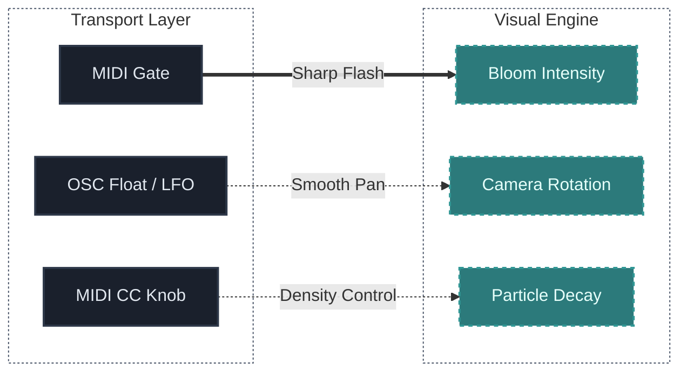

## Что ты изучишь

К концу урока ты должен понять:

- разницу между протоколами MIDI и OSC
- почему MIDI устарел для некоторых задач, но до сих пор незаменим
- что такое Open Sound Control (OSC) и в чем его преимущества
- принципы маппинга параметров между разными софтверными экосистемами

## Основная идея

Чтобы соединить звук и визуализацию, если они существуют в разных софтверных экосистемах (например VCV Rack и TouchDesigner/WebGL), необходим надежный "транспортный слой".

Даже самый гениальный патч не раскачает 3D-графику, если команды не дойдут вовремя или будут ограничены низким разрешением.

В аудиовизуальных проектах используют протоколы:
- **MIDI** (Musical Instrument Digital Interface)
- **OSC** (Open Sound Control)
- **Внутренний маппинг** API (если обе подсистемы живут в одной программе или браузере)

## Почему это важно

Без чёткой транспортной модели и документации маппинга аудиовизуальная установка становится импровизированной и хрупкой. Настройка стабильных каналов связи — это фундамент, без которого нельзя начать "заставлять" пиксели двигаться под музыку.

## MIDI против OSC

### MIDI (Классика)
Передает дискретные события: "Нота C3 нажата, Velocity 100" или CC сообщения (Continuous Control).

**Преимущества:** Универсален, поддерживается железом и DAW "из коробки". Отлично подходит для триггеров и квантизированных команд.
**Недостатки:** Низкое разрешение (всего 128 шагов). При медленной модуляции визуального параметра это вызовет дерганье (stepping). Ограничен количеством каналов и кабелями.

### OSC (Open Sound Control - Современность)
Работает через сетевые протоколы (UDP/TCP) и использует человекочитаемые пути. Например: `/synth/bass/filter` передает число `0.85231`.

**Преимущества:** Высочайшее разрешение (тип Float), позволяющее передавать сверх-плавные кривые генераторов и LFO без рывков. Передается по локальной сети или Wi-Fi (можно послать сигнал с ноутбука музыканта на мощный PC визуализатора).
**Недостатки:** Требует настройки портов сети. Не каждое оборудование понимает OSC аппаратно.

## Практическое применение в проекте

- **MIDI** идеален для *событий* (Kick Drum trigger, Scene Change).
- **OSC** идеален для передачи *состояний плавных и хаотических процессов* (медленный LFO, изменяющаяся кривая огибающей дрона).

## Типичные ошибки новичков

### Ошибка 1: Путаница с сетевыми портами при использовании OSC
В OSC критическую роль играют IP адреса и Порты. Новички часто забывают, что если VCV Rack отправляет данные на `Port 8000`, визуальный приемник тоже должен быть настроен на "Listen Port 8000".

### Ошибка 2: Засорение сети переизбытком OSC сообщений
Если отправить аудио частоты (44100 данных в секунду) по OSC, сеть мгновенно "подавится" и зависнет. Для OSC лучше отправлять только медленно изменяющиеся модуляции параметров.

## Маршрутизация в Rack (Например с модулем cvOSCcv)
1. Выводим LFO-сигнал с модуля в VCV.
2. Соединяем его во вход модуля OSC (который есть в библиотеке).
3. Назначаем локальный IP `127.0.0.1` (если все на одном компе) и порт (как `7000`).
4. Настраиваем отправку пути: ` /vcv/lfo`.
5. В целевой программе слушаем порт 7000 и путь `/vcv/lfo`.

## Практика

Создайте мини-таблицу ("Маппинг-Лист") с тремя любыми связками в вашем проекте:

**Пример маппинг-листа:**

Подумайте, на каком протоколе эти 3 сигнала лучше было бы передать.

## Дополнительное упражнение

Попробуйте подключить смартфон к компьютеру через OSC-приложения (например, "TouchOSC"). Вы сможете создать собственный интерфейс с ползунками на телефоне и отправлять данные напрямую в аудиовизуальную связку по Wi-Fi, управляя звуком и графикой прямо с экрана телефона.

## Следующая связь

Когда каналы установлены и мы умеем общаться с визуальными средствами, пора собирать все воедино — настраивать стейджем и готовить цельную АудиоВизуальную живую "Сцену", что мы и разберем в финальном уроке секции.

---

### Файлы к уроку
- [Перейти к обзору патча Hybrid Live Set v01](/patches/performances-hybrid-live-set-v01)
