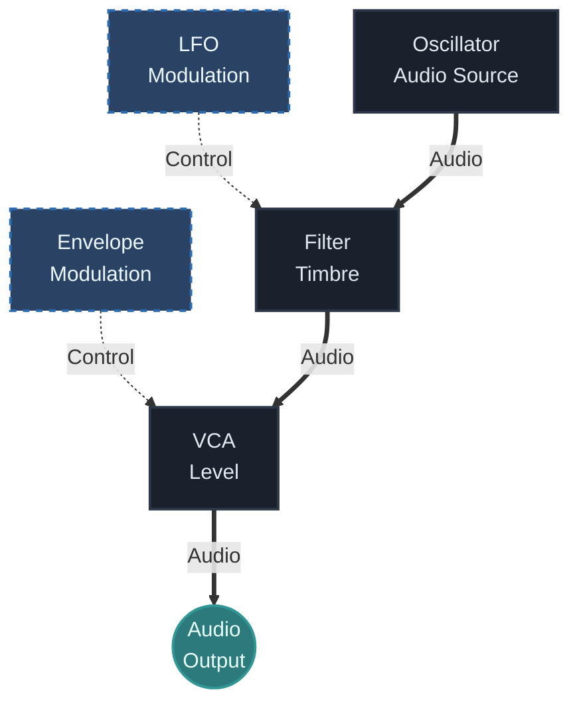

## Что ты изучишь

К концу урока ты должен понять:

- что в модульном патче считается `audio`
- что такое `CV` и зачем он нужен
- почему два одинаково выглядящих кабеля могут выполнять совершенно разные роли
- как быстро определить, сигнал нужно слышать или он должен что-то контролировать
- как это различие помогает собирать более чистые и осознанные патчи

## Основная идея

В модульном синтезе не каждый сигнал является звуком.

Одни сигналы предназначены для прослушивания. Это audio signals.

Другие сигналы предназначены для изменения поведения системы. Это управляющие сигналы, которые часто называют `CV`, то есть control voltage.

Это одно из самых важных различий в modular practice, потому что оно меняет сам способ мышления о патче. Кабель здесь не просто соединение. Он описывает функцию.

## Почему это важно

Если не понимать разницу между `CV` и `audio`, патчи очень быстро начинают казаться хаотичными.

Ты видишь, что что-то подключено, но не понимаешь, зачем именно.

Когда различие становится ясным, патч начинает читаться проще:

- аудиотракт объясняет, что ты слышишь
- управляющий тракт объясняет, почему звук меняется

На этом строятся envelopes, sequencing, automation, modulation, generative systems и performance control.

## Аудиосигналы

Аудиосигнал — это сигнал, который предназначен для непосредственного прослушивания.

Обычные примеры:

- выход осциллятора
- выход noise source
- выход фильтра после формирования тембра
- финальный сигнал после микшера или VCA

Когда audio доходит до колонок, наушников, рекордера или входа DAW, он становится слышимым результатом патча.

Если говорить просто, audio отвечает на вопрос:

- как система звучит прямо сейчас?

## Управляющие сигналы

Управляющий сигнал существует не для того, чтобы его слушать напрямую. Он нужен для изменения поведения другой части системы.

Типичные примеры:

- управление высотой осциллятора
- envelope, управляющая уровнем `VCA`
- `LFO`, двигающий cutoff фильтра
- секвенсор, меняющий ноты во времени
- gates и triggers, запускающие события

Если говорить просто, `CV` отвечает на вопрос:

- что заставляет систему двигаться, реагировать или изменяться?

## Один и тот же кабель, но разная работа

Одна из причин, почему эта тема путает новичков, в том, что сам patch cable не показывает, несёт он audio или control.

Один и тот же физический кабель может передавать:

- слышимую волну
- медленную форму модуляции
- инструкцию по высоте
- gate event

Поэтому правильный вопрос никогда не звучит просто как:

- "Здесь есть кабель?"

Намного полезнее спрашивать:

- "Какую роль играет этот сигнал в данном соединении?"

## Практическое правило

Каждый раз, когда ты что-то патчишь, задавай два вопроса:

1. Этот сигнал нужно слышать?
2. Или он должен управлять другим параметром?

Это простое правило снимает большую часть начальной путаницы.

Если ответ "это должно звучать", скорее всего перед тобой audio.

Если ответ "это должно что-то менять", скорее всего перед тобой control signal.

## Простой пример

Рассмотрим такой патч:

Здесь роли распределяются так:

- осциллятор даёт audio
- тракт через фильтр остаётся audio
- `LFO` является control signal
- envelope тоже является control signal
- выход `VCA` снова становится финальным audio

Именно в этот момент модульная система начинает читаться осмысленно. Ты подключаешь не просто модули, а разные типы поведения.

## Как быстро распознать разницу

Когда ты читаешь патч, используй быструю проверку:

### Если сигнал идёт в аудиотракт

Например:

- во вход микшера
- в audio input фильтра
- в audio input `VCA`
- в финальный output

то это, скорее всего, audio.

### Если сигнал идёт во вход параметра

Например:

- modulation cutoff
- pitch input
- control уровня `VCA`
- amount у wavefolder

то это, скорее всего, control.

Это не абсолютное техническое правило для всех модулей без исключения, но для новичка оно очень полезно.

## Частые ошибки новичков

### Ошибка 1: считать, что каждое соединение является частью слышимого звука

Не всё в патче относится к слышимому тракту. Большая часть modular intelligence находится в управляющих связях.

### Ошибка 2: думать, что `CV` это только pitch

Pitch — только один вид управления. `CV` может влиять на громкость, тембр, тайминг, probability, панораму, эффекты и многое другое.

### Ошибка 3: смотреть только на источник модуляции

Новички часто видят, что у них есть `LFO` или envelope, но забывают спросить, что именно меняет destination input.

### Ошибка 4: использовать modulation без цели

То, что `LFO` может двигать параметр, ещё не значит, что это движение нужно музыке. Важнее понять, зачем оно там вообще.

## Практика

Собери простой патч и проверь три типа сигналов:

1. Осциллятор в output
2. `LFO` в cutoff фильтра
3. Envelope в уровень `VCA`

Потом опиши каждый случай одной короткой фразой:

- этот сигнал слышен напрямую или нет?
- что именно он меняет?
- как ведёт себя патч, если убрать это соединение?

## Дополнительное упражнение

Возьми один modulation source, например `LFO`, и по очереди отправь его в три разные точки:

- высота осциллятора
- cutoff фильтра
- уровень `VCA`

Сначала не подключай все три сразу.

Послушай и зафиксируй:

- какой результат кажется музыкальным
- какой результат ощущается нестабильным
- какое destination легче всего понять на слух

Это упражнение тренирует связь между типом сигнала и тем, как он влияет на поведение системы.

## Что дальше

Следующий урок должен сделать это различие практическим: мы соберём первый полноценный subtractive patch.

Именно там `audio` и `CV` перестают быть абстрактными категориями и начинают работать вместе как playable instrument.

---

### Файлы к уроку
- [Перейти к обзору патча Basic Voice v01](/patches/foundations-basic-voice-v01)
