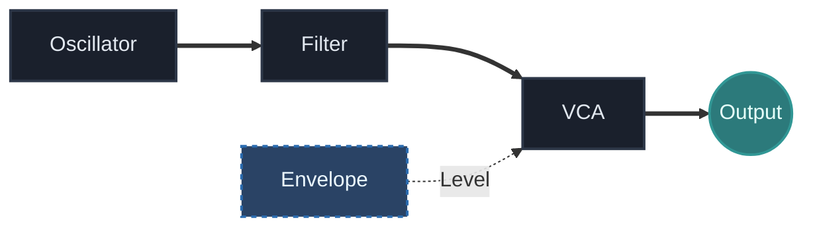
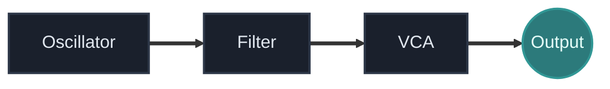
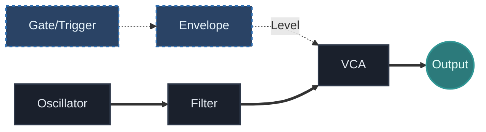
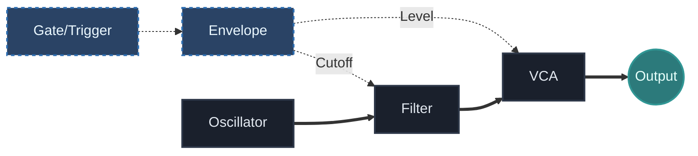

## Что ты изучишь

К концу урока ты должен понять:

- как с нуля собрать первый полноценный subtractive patch
- почему модель `oscillator -> filter -> VCA -> output` настолько важна
- где в патче находится envelope и что именно она контролирует
- как тембр и громкость взаимодействуют, но остаются разными функциями
- как из одного простого голоса получить несколько музыкальных вариантов

## Основная идея

Субтрактивный синтез начинается с сигнала, в котором уже есть гармоническое содержание, а затем формирует этот сигнал, убирая, подчёркивая или контролируя его части во времени.

В модульной логике классический базовый voice выглядит так:

Это одна из самых важных patch models во всём проекте.

Она учит различать:

- источник
- формирование тембра
- управление амплитудой
- финальный выход
- временной контроль через envelope

Когда эта структура становится понятной, многие следующие системы перестают казаться абстрактными.

## Почему этот патч важен

Даже когда дальнейшие патчи становятся сложнее, логика этого голоса обычно всё равно где-то внутри сохраняется.

В generative patch может быть несколько слоёв, модуляция, probability и сложный routing, но внутри системы почти всегда остаются:

- что-то, что создаёт звук
- что-то, что формирует тембр
- что-то, что контролирует присутствие или громкость
- что-то, что определяет, когда звук вообще появляется

Поэтому этот урок важен не только как стартовое упражнение. Это устойчивая ментальная модель.

## Основной signal path

Базовая субтрактивная цепь выглядит так:

Каждый блок отвечает на свой вопрос.

### Oscillator

Осциллятор создаёт исходный материал.

Для этого урока лучше выбрать волну с заметным гармоническим содержанием, чтобы работа фильтра была хорошо слышна:

- saw wave
- pulse wave
- square wave

Синус тоже возможен, но он хуже показывает суть subtractive shaping, потому что в нём меньше гармоник, которые можно убрать фильтром.

### Filter

Фильтр формирует тембр.

Самый понятный стартовый вариант — low-pass filter, потому что на нём сразу слышно, как звук темнеет при снижении cutoff.

Фильтр отвечает на вопрос:

- насколько ярким или тёмным должен быть этот голос?

### VCA

`VCA` управляет уровнем сигнала.

Он нужен не только для статической громкости. В музыкальном патче именно через него envelope обычно формирует атаку, спад и длительность звука.

`VCA` отвечает на вопрос:

- когда звук появляется и как он исчезает?

### Output

Финальный этап отправляет сигнал наружу, чтобы его вообще можно было услышать.

Без него патч может быть логически верным, но по факту молчать.

## Где находится envelope

Envelope — это слой управления, который превращает subtractive voice в playable instrument.

Минимальная playable-версия выглядит так:

Здесь envelope не является audio. Это control shape.

Она говорит `VCA`, как должен развиваться звук после ноты или trigger event.

Именно здесь предыдущий урок становится практикой:

- тракт осциллятора это audio
- тракт envelope это control

## Базовые шаги патча

Собирай патч в таком порядке:

1. Добавь осциллятор и выбери волну с богатым спектром.
2. Отправь осциллятор в audio input фильтра.
3. Отправь выход фильтра в audio input `VCA`.
4. Отправь выход `VCA` в финальный output module.
5. Добавь envelope generator.
6. Отправь выход envelope во вход уровня или CV у `VCA`.
7. Добавь gate или trigger source, чтобы envelope действительно срабатывала.

Если у тебя получается постоянный drone без артикуляции, проверь, правильно ли контролируется `VCA`.

Если патч молчит, проходи цепь по порядку и проверяй каждый этап отдельно.

## Что здесь нужно слушать

Когда патч заработал, слушай в нём отдельно несколько измерений:

### Характер источника

Как звучит сама волна до фильтра?

### Яркость

Насколько сильно фильтр меняет ощущение энергии и окраску звука?

### Форма во времени

Делает ли envelope звук резким, мягким, коротким или протяжённым?

### Финальное присутствие

Делает ли `VCA` звук управляемым и собранным, а не просто постоянно включённым?

Такое слушание важно, потому что ты учишься слышать роль каждого этапа отдельно.

## Ещё один слой: envelope в filter

Когда базовый патч уже работает, попробуй такое расширение:

Теперь одна envelope формирует сразу:

- громкость
- тембр

Из-за этого звук становится живее, потому что яркость меняется вместе с амплитудной формой.

Это одна из классических причин, почему subtractive synthesis может звучать выразительно даже с небольшим набором модулей.

## Частые ошибки новичков

### Ошибка 1: пропускать логику VCA

Новички часто собирают oscillator -> filter -> output и не понимают, почему результат звучит незавершённо.

Если `VCA` не контролируется, у звука часто нет нормальной артикуляции.

### Ошибка 2: использовать слишком бедный по спектру источник

Если исходная волна слишком простая, может показаться, что фильтр почти ничего не делает.

### Ошибка 3: менять всё сразу

Если одновременно крутить waveform, cutoff, resonance и envelope settings, становится сложно понять причину каждого изменения.

### Ошибка 4: считать фильтр главным и единственным центром патча

Фильтр важен, но subtractive synthesis держится на взаимодействии источника, формирования тембра и контроля амплитуды.

## Практика

Собери патч, а потом создай три варианта:

1. Bass
2. Pad
3. Drone

Для каждого варианта запиши:

- какую волну ты выбрал
- насколько открыт или закрыт фильтр
- короткая или длинная envelope используется
- что именно делает этот вариант отличным от остальных

## Дополнительное упражнение

После того как сделаешь три варианта, оставь ту же структуру патча и меняй только один параметр за раз:

- waveform
- filter cutoff
- resonance
- attack
- release

Это тренирует важную дисциплину: менять одну ось, а потом слушать.

Именно так становится понятно, за что отвечает каждый элемент voice architecture.

## Что дальше

Следующий урок расширит этот voice через envelopes и `LFO` как отдельные инструменты модуляции.

Именно там subtractive patch перестаёт быть просто рабочим и начинает становиться выразительным.

---

### Файлы к уроку
- [Перейти к обзору патча Basic Voice v01](/patches/foundations-basic-voice-v01)
