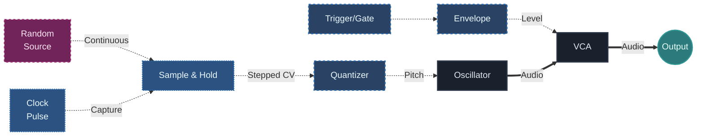

## Что ты изучишь

К концу урока ты должен понять:

- почему свободная случайность часто ощущается бесполезной, пока её не структурируют
- что именно делает `Sample & Hold` в патче
- как clocked sampling превращает непрерывное изменение в ступенчатое поведение
- почему quantizer часто становится следующим полезным этапом после `Sample & Hold`
- как собрать простую generative pitch system, которая остаётся управляемой

## Основная идея

Случайность становится музыкально полезной тогда, когда её семплируют в осмысленные моменты времени.

Непрерывно меняющийся random signal может быть интересным, но без timing control он часто ощущается нестабильным, скользящим и трудным для фразировки.

`Sample & Hold` меняет это.

Он работает так:

- random source доступен непрерывно
- clock решает, когда захватить значение
- удержанное значение остаётся стабильным до следующего захвата

Этот простой процесс — один из самых важных generative building blocks в modular synthesis.

## Почему это важно

Generative patching не означает "пусть хаос делает всё сам."

На практике самые сильные generative systems почти всегда строятся на балансе между:

- непредсказуемостью
- timing control
- контролем диапазона
- музыкальными ограничениями

`Sample & Hold` — один из самых понятных примеров такого баланса.

Он берёт что-то нестабильное и делает это читаемым.

## Свободная случайность и clocked random

Полезно различать две ситуации.

### Свободная случайность

Random source может двигаться постоянно и непрерывно.

Это полезно для:

- texture
- drift
- analog instability
- organic motion

Но для ясного melodic sequencing сам по себе такой сигнал часто менее удобен.

### Clocked random

Как только clock говорит системе, когда нужно захватить значение, случайность становится событием.

Теперь у патча появляется:

- момент, когда изменение происходит
- стабильное значение между событиями
- более ясная фразировка

Это и есть первый большой переход от абстрактной случайности к usable generative behavior.

## Что делает Sample & Hold

`Sample & Hold` захватывает входящее напряжение в момент trigger или clock event, а затем удерживает это значение до следующего события.

То есть он отвечает сразу на два вопроса:

- какое значение было на входе в момент семплирования?
- как долго это значение должно оставаться стабильным?

Именно поэтому это такой сильный модуль. Он создаёт дискретные шаги из непрерывно меняющегося источника.

## Базовый патч

Основной патч выглядит так:

В этом патче:

- random source даёт непредсказуемое voltage
- clock решает, когда появляется новое note value
- `Sample & Hold` замораживает это значение
- quantizer делает результат музыкально читаемым

Это одна из самых простых и самых сильных beginner generative pitch systems.

## Почему здесь помогает quantizer

Без quantizer `Sample & Hold` всё равно может давать ступенчатую вариативность, но результат по pitch часто ощущается слишком произвольным.

С quantizer:

- случайные изменения остаются внутри scale
- мелодический результат легче услышать как осмысленный, а не шумовой
- экспериментировать становится проще

Это повторяющийся modular lesson:

случайность становится сильнее, когда её пространство результатов ограничено.

## Что здесь нужно слушать

Когда патч работает, слушай в нём отдельно несколько слоёв:

### Частота изменений

Как часто появляется новое значение?

### Стабильность между изменениями

Остаётся ли pitch ясно удерживаемым между clock events?

### Музыкальный диапазон

Остаётся ли quantized output в полезном пространстве нот?

### Характер фразы

Результат ощущается разреженным, активным, спокойным, нервным, тональным или странным?

Такой способ слушания важен, потому что generative systems проще формировать, когда ты слышишь разные контрольные слои по отдельности.

## Медленный clock и быстрый clock

Очень полезно сравнивать разные clock speeds.

### Медленный clock

- меньше смен нот
- больше пространства между событиями
- часто более ambient или sparse feeling

### Быстрый clock

- более активные patterns
- более заметное движение
- выше риск, что всё начнёт звучать слишком busy или chaotic

Важный момент в том, что random source может оставаться тем же самым, но музыкальный смысл полностью меняется только из-за изменения ритма семплирования.

## Частые ошибки новичков

### Ошибка 1: использовать случайность без временной структуры

Если патч всё время меняется, но никогда не стабилизируется, он может ощущаться скорее запутанным, чем музыкальным.

### Ошибка 2: винить random source в плохой фразировке

Часто проблема не в "слишком большой случайности", а в отсутствии clock logic, range control или quantization.

### Ошибка 3: давать слишком широкий pitch range

Если sampled voltage покрывает слишком большой диапазон, результат может прыгать слишком далеко и терять цельность.

### Ошибка 4: забывать, что `Sample & Hold` это timing tool не меньше, чем variation tool

Он не только создаёт случайные ноты. Он определяет, когда значению вообще разрешено измениться.

## Практика

Попробуй три теста:

1. Медленный clock для редких смен нот
2. Быстрый clock для активных patterns
3. Разные scales в quantizer

Для каждой версии запиши:

- что меняется случайно
- что удерживается стабильным
- чем именно управляет clock
- ощущается ли результат музыкальным, нестабильным, спокойным или хаотичным

## Дополнительное упражнение

Возьми тот же патч и меняй только один параметр за раз:

- clock speed
- pitch range до quantizer
- выбор scale в quantizer

Не меняй всё сразу.

Это развивает одну из самых полезных generative habits:

отделять источник непредсказуемости от правил, которые его формируют.

## Что дальше

Теперь ты умеешь превращать случайность в ступенчатое мелодическое поведение.

Следующий шаг — управлять тем, как часто происходят события и насколько вероятны разные варианты.

Это естественно ведёт к probability и mutation.

---

### Файлы к уроку
- [Перейти к обзору патча Generative Ambient v01](/patches/generative-generative-ambient-v01)
