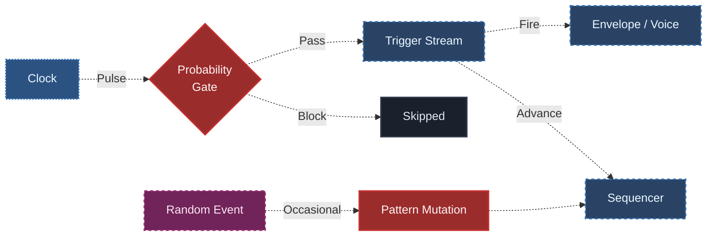

## Что ты изучишь

К концу урока ты должен понять:

- что означает probability в модульном патче
- чем mutation отличается от чистой случайности
- почему пропуск событий часто музыкальнее, чем полная замена всего паттерна
- как удерживать generative patch в движении, не давая ему распасться в шум
- как сравнивать стабильность и вариативность контролируемым способом

## Основная идея

Probability — один из главных инструментов, благодаря которым модульный патч начинает ощущаться живым.

Она контролирует не только что должно произойти, но и должно ли это вообще произойти.

Именно это различие здесь очень важно.

Вместо того чтобы переписывать всю систему, probability смягчает повторение, делая события условными.

Это влияет на:

- плотность нот
- ритмическое разнообразие
- пропуск trigger events
- accent patterns
- mutation паттерна

Именно здесь патч перестаёт быть слишком механическим, но ещё не теряет направление.

## Почему это важно

Повторяющийся патч становится generative тогда, когда повторение смягчается условным изменением.

Если всё повторяется буквально, система может ощущаться статичной.

Если всё меняется всё время, система может потерять идентичность.

Probability даёт патчу пространство для эволюции, сохраняя при этом узнаваемый центр.

Mutation делает нечто похожее, но немного другое:

- probability управляет тем, случится ли событие
- mutation меняет то, как сам паттерн ведёт себя во времени

Вместе они создают живую структуру вместо жёсткой петли или неуправляемого хаоса.

## Probability: условные события

В modular synthesis probability обычно означает, что событие имеет некоторый шанс произойти, а не гарантированно происходит каждый раз.

Например:

- trigger может срабатывать только в 70% случаев
- нота может иногда пропускаться
- reset может происходить редко
- accent может появляться условно

Это сильный инструмент, потому что он меняет поведение, не обязательно переписывая всю архитектуру патча.

Probability отвечает на вопрос:

- должно ли это событие произойти сейчас?

## Mutation: изменение паттерна во времени

Mutation — это не просто случайность.

Полезно думать о ней так:

- есть существующий pattern
- какая-то его часть меняется
- система всё ещё сохраняет достаточно идентичности, чтобы оставаться узнаваемой

Mutation может затрагивать:

- один шаг последовательности
- один выбор pitch
- одно ритмическое событие
- один modulation destination
- одно правило внутри patch logic

Mutation отвечает на вопрос:

- как системе стать другой, не став совершенно чужой самой себе?

## Probability против Mutation

Эти понятия связаны, но это не одно и то же.

### Probability

- решает, случится ли событие
- часто работает на уровне каждого момента
- влияет на плотность и вариативность

### Mutation

- меняет сам pattern
- чаще работает на более длинных временных отрезках
- влияет на идентичность и развитие

Сильный generative patch часто использует оба подхода:

- probability для краткосрочного поведения
- mutation для долгосрочной эволюции

## Базовая идея патча

Практичный beginner patch может выглядеть так:

Здесь роли ясны:

- clock даёт структуру
- probability stage решает, какие события проходят дальше
- downstream system реагирует только на те события, которые прошли
- отдельный change source может иногда мутировать pattern

Так сохраняется основная пульсация, но система получает пространство для дыхания.

## Почему пропуск так силён

Один из самых полезных beginner lessons в том, что удаление событий может быть не менее музыкально важным, чем добавление новых.

Если каждый trigger всегда проходит, патч может ощущаться слишком жёстким.

Если некоторые trigger events пропускаются:

- меняется плотность
- смещается groove
- фразы становятся более открытыми
- повторение перестаёт быть слишком очевидным

Probability часто сильнее всего работает не тогда, когда делает всё странным, а когда вводит выборочное отсутствие.

## Стабильная идентичность и свободная вариативность

Это и есть главный баланс generative design.

### Слишком стабильно

- патч буквально повторяется
- слушатель слишком быстро считывает pattern
- система начинает ощущаться статичной

### Слишком свободно

- слишком много событий пропадает
- pitch или rhythm теряют цельность
- система перестаёт звучать осмысленно

Цель обычно не в максимальной случайности. Цель — в контролируемом движении внутри узнаваемой рамки.

## Что здесь нужно слушать

Когда работаешь с probability и mutation, слушай:

### Плотность событий

Насколько busy или sparse ощущается система?

### Идентичность

Остаётся ли патч "тем же самым паттерном" после изменений?

### Surprise

Вариации ощущаются интересными или просто запутанными?

### Долгосрочное поведение

Чувствуется ли, что патч развивается, или он просто бесцельно колеблется?

Такой способ слушания важен, потому что generative systems оцениваются не по одному событию, а по тому, как они ведут себя во времени.

## Частые ошибки новичков

### Ошибка 1: путать вероятность с качеством

Больше вариативности не значит лучше автоматически. Слишком много условного поведения может стереть структуру, которая и делала патч интересным.

### Ошибка 2: мутировать всё сразу

Если слишком много слоёв меняются одновременно, становится трудно услышать, что именно формирует результат.

### Ошибка 3: использовать probability без ясного базового паттерна

Variation наиболее осмысленна, когда есть что-то стабильное, что можно варьировать.

### Ошибка 4: забывать про временной масштаб

Одни изменения должны происходить каждый beat, другие раз в несколько bars. Mutation становится намного музыкальнее, когда работает на более медленном time scale, чем основной pulse.

## Практика

Собери один патч с высокой стабильностью поведения и один патч с более высокой вариативностью.

Сравни:

1. Как часто события пропускаются
2. Насколько хорошо паттерн сохраняет идентичность
3. В какой момент вариативность становится слишком рыхлой

Для каждой версии запиши:

- что остаётся фиксированным
- что меняется условно
- ощущается ли патч живым, повторяющимся или хаотичным

## Дополнительное упражнение

Возьми один стабильный pattern и добавляй только один тип вариативности за раз:

- trigger probability
- occasional note mutation
- probability только на accents

Не накладывай всё сразу.

Это учит одному из ключевых принципов generative design:

маленькие условные изменения часто сильнее, чем большие неуправляемые.

## Что дальше

Когда probability и mutation уже работают, следующий шаг — исследовать feedback и более медленные modulation systems, которые перестраивают патч на длинных временных промежутках.

Именно там generative design начинает ощущаться по-настоящему средовым и эволюционирующим.

---

### Файлы к уроку
- [Перейти к обзору патча Probability Grid v01](/patches/generative-probability-grid-v01)
