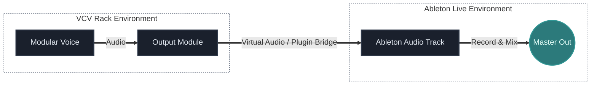

## Что ты изучишь

К концу урока ты должен понять:

- как проект рассматривает `VCV Rack` и `Ableton Live` как два слоя одной системы
- чем отличается standalone Rack workflow от hosted Rack workflow
- что значит, когда одно приложение владеет audio engine
- как аудиосигнал обычно проходит из Rack в Ableton
- как планировать routing до патча, чтобы вся система оставалась ясной

## Основная идея

Hybrid model этого проекта рассматривает инструменты так:

- `VCV Rack` генерирует и трансформирует звук
- `Ableton Live` записывает, аранжирует, редактирует и микширует

Такое разделение полезно, потому что у каждого инструмента своя сильная роль.

Но чтобы workflow был надёжным, audio должно двигаться между ними чисто и предсказуемо.

Большая часть hybrid-проблем возникает не из-за плохого sound design, а из-за неясного routing.

## Почему это важно

Если ты не понимаешь, какое приложение владеет audio path, hybrid work очень быстро начинает путаться.

Обычно проблемы начинаются с таких вопросов:

- где вообще работает audio engine?
- какое приложение сейчас мониторит сигнал?
- какое приложение пишет результат?
- Rack сейчас выступает как инструмент, процессор или отдельная самостоятельная система?

Когда эти роли ясны, workflow резко упрощается.

## Главный hybrid principle

Прежде чем что-то патчить, реши три вещи:

1. Что генерирует звук?
2. Что принимает звук?
3. Что записывает или аранжирует звук?

Звучит просто, но именно это предотвращает очень много лишней путаницы.

## Основные сценарии

Есть два типичных hybrid setup.

### Standalone Rack

В этой модели:

- Rack владеет audio engine
- Rack работает как отдельное приложение
- Ableton принимает аудио извне Rack
- часто нужен virtual routing

Этот вариант полезен, когда:

- Rack работает как самостоятельная modular environment
- ты хочешь, чтобы Rack жил независимо
- тебя устраивает межпрограммная маршрутизация аудио

### Hosted Rack

В этой модели:

- Ableton владеет audio engine
- Rack работает как plugin внутри DAW
- routing обычно проще
- запись и sync часто прямее и удобнее

Этот вариант полезен, когда:

- Ableton является центром всей сессии
- тебе нужен более лёгкий recall и arrangement
- ты хочешь, чтобы DAW управляла transport и project flow

## Что значит "владеть audio engine"

Это одна из самых важных практических идей.

Если приложение владеет audio engine, значит именно оно:

- напрямую работает с audio device
- управляет buffer settings
- определяет основной monitoring path

Поэтому если audio engine у Rack, Ableton должен как-то получить сигнал из Rack.

Если audio engine у Ableton, Rack обычно ведёт себя как source или processor внутри среды Ableton.

Это одно различие объясняет огромную часть routing-confusion.

## Простая модель маршрутизации

Базовая standalone-модель выглядит так:

Сначала здесь важна не конкретная утилита.

Сначала важно понять:

- где звук выходит из Rack
- как он заходит в Ableton
- где он мониторится и записывается

## Зачем нужен virtual routing

Когда Rack работает отдельно от Ableton, аудио должно физически пройти из одной программы в другую.

Для этого обычно нужен:

- plugin-hosted path
- virtual audio cable или loopback route
- или другой system-level audio bridge

Конкретная утилита зависит от платформы и workflow, но логика всегда одна:

audio должно выйти из одной software environment и без двусмысленности попасть в другую.

## Частые ошибки новичков

### Ошибка 1: сначала патчить, а routing решать потом

Из-за этого звук может уже существовать в Rack, но так и не доходить туда, где ты ждёшь его увидеть в Ableton.

### Ошибка 2: забывать, кто именно мониторит

Иногда сигнал уже есть, но ты слушаешь не через тот application path.

### Ошибка 3: путать генерацию звука и запись

Rack может быть sound engine, но именно Ableton может оставаться местом, где финальный performance записывается и собирается в arrangement.

### Ошибка 4: делать систему сложнее, чем нужно

Если цель просто "Rack voice в Ableton track", начинай с самого маленького чистого маршрута, и только потом добавляй returns, effects, clocking или multichannel complexity.

## Практика

Сначала нарисуй свой точный routing plan:

1. Что генерирует звук
2. Что принимает звук
3. Что его записывает

Потом добавь ещё по одной строке:

- где происходит monitoring
- какое приложение владеет audio engine
- где сигнал покидает одну среду и входит в другую

Этот маленький подготовительный шаг — одна из самых полезных hybrid habits.

## Дополнительное упражнение

Возьми один простой modular voice и опиши его в обеих workflow-моделях:

- standalone Rack отправляет audio в Ableton
- Rack хостится внутри Ableton

Для каждого варианта спроси себя:

- что стало проще?
- что стало сложнее?
- какой вариант ближе к твоему реальному workflow?

## Что дальше

Когда routing уже понятен, следующий hybrid-шаг — уметь захватывать и организовывать сразу несколько signal paths.

Именно это естественно ведёт к multichannel recording и более собранной студийной интеграции.

---

### Файлы к уроку
- [Перейти к обзору патча Hybrid Live Set v01](/patches/performances-hybrid-live-set-v01)
